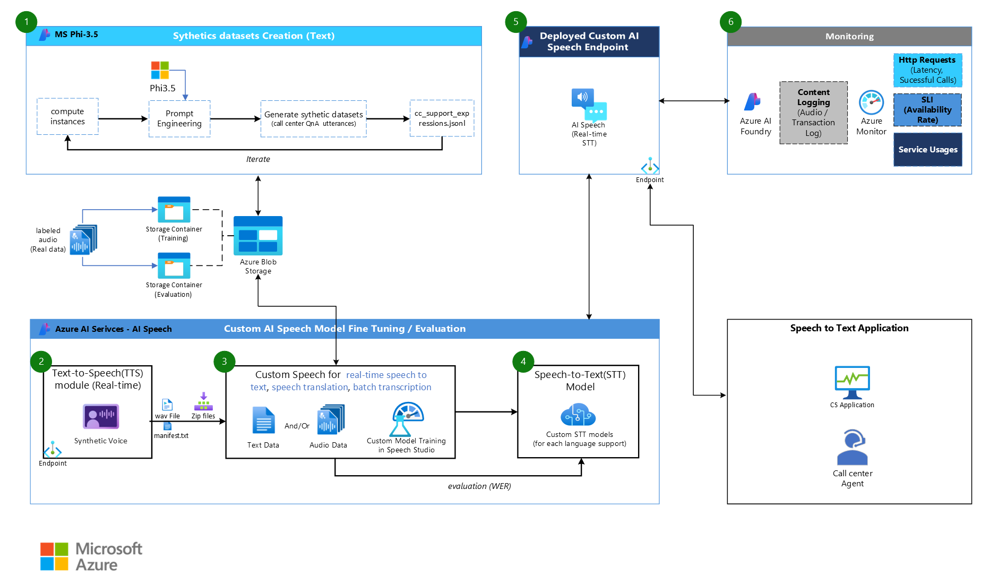

# Azure_OpenAI_samples
## Azure Custom Speech with Python SDK and REST API 
- Azure AI Speech is a managed service that provides speech capabilities such as speech-to-text, text-to-speech, voice translation, and speaker recognition. In this hands-on, you will learn the entire end-to-end process of training a custom Speech To Text (STT) model optimised for a specific language and use case based on synthetic data. You can practice generating synthetic text data (gpt4o), converting generated text files to audio files (Text to Speech), training(Speech to Text), evaluating, and deploying custom AI speech models based on synthetic text/audio files using Python SDK and REST API. In addition to generating synthetic data, you can also upload the speech data you are using in the field to a specific folder and upload it to the storage account with simple notebook code to proceed with dataset creation, training, and evaluation. <a href="https://github.com/hyogrin/Azure_OpenAI_samples/blob/main/Azure%20Custom%20Speech/0_text_data_generation.ipynb">Go to notebook</a>
    > Azure AI Speech는 음성 텍스트 변환, 텍스트 음성 변환, 음성 번역, 화자 인식과 같은 음성 기능을 제공하는 관리형 서비스입니다. 본 핸즈온에서는 특정 언어와 유스케이스에 최적화된 Custom STT(Speech To Text)모델 학습의 End2End 전체과정을 합성데이터(Syntethic data)기반으로 실습합니다. 합성 텍스트 데이터 생성(gpt4o), 생성된 텍스트파일을 오디오파일로 변환 (Text to Speech), 합성 텍스트/오디오파일 기반의 Custom AI Speech 모델 학습(Speech to Text), 평가, 배포를 Python SDK와 REST API기반으로 실습해볼 수 있습니다. 합성데이터를 생성하는 것 외에도 현장에서 활용하고 있는 음성데이터를 특정 폴더에 업로드하면 간단한 노트북 코드로 Storage Account에 업로드 및 데이터셋 생성, 학습 및 평가 과정을 진행해볼 수도 있습니다. 
 <a href="https://github.com/hyogrin/Azure_OpenAI_samples/blob/main/Azure%20Custom%20Speech/0_text_data_generation.ipynb">Go to notebook</a>

## 🥇Other Resources

### Azure Custom Speech Python SDK
- https://learn.microsoft.com/en-us/azure/ai-services/speech-service/quickstarts/setup-platform?pivots=programming-language-python&tabs=windows%2Cubuntu%2Cdotnetcli%2Cdotnet%2Cjre%2Cmaven%2Cnodejs%2Cmac%2Cpypi

### Azure Custom Speech REST API
https://learn.microsoft.com/en-us/azure/ai-services/speech-service/rest-speech-to-text 

## Author
Date of creation: 15-Oct-2024 
Updated: 11-Nov-2024 
 
Hyo Choi | hyo.choi@microsoft.com | https://www.linkedin.com/in/hyogrin/ 