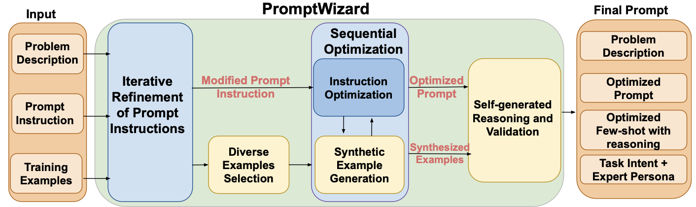
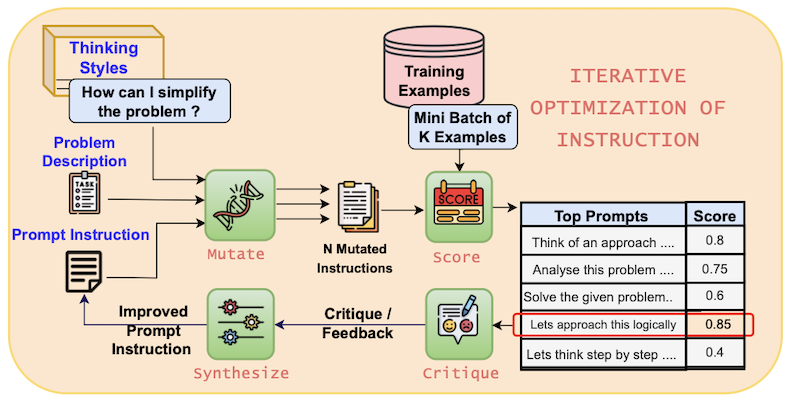
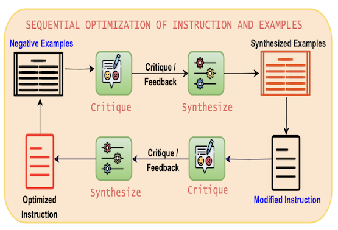

# Prompt Optimization using PromptWizard

## 1. Overview
마이크로소프트에 오픈 소스와 논문으로 공개한 PromptWizard는 LLM의 성능을 극대화하기 위한 프롬프트 최적화 도구입니다. LLM이 스스로 프롬프트와 예제를 생성, 비평, 정교하고 피드백과 합성을 통해 지속적으로 개선하는 자기 진화 메커니즘을 채택한 프롬프트 최적화 프레임워크입니다.
- Paper: https://arxiv.org/abs/2405.18369
- Project: https://github.com/microsoft/PromptWizard



#### Iterative Refinement of Prompt Instructions
- 초기 프롬프트 명령을 **다양한 방식으로 수정(mutate)** 하고 다양한 스타일을 사용하여 프롬프트의 변형 생성
- 각각의 프롬프트 변형에 대해 **스코어링(score), 비평(critique), 합성(synthesize)** 주기를 통해 프롬프트 개선 수행

#### Diverse Example Selection & Sequential Optimization
- 학습 데이터로부터 **다양한 예시들(few-shot examples)** 선택
- 좋은 예시(positive)와 나쁜 예시(negative)를 분류하여 예시를 평가하고(critique) 합성 (synthesize)
- 필요 시 반복적으로 이 과정을 **정제(refine)하여** 최적화된 프롬프트에 포함

#### Final prompt: Integration of Task Intent and Expert Persona
- **Optimized Few-shot with reasoning**: LLM이 문제를 해결하기 위한 구체적인 예시와 함께 논리적 추론 체인(CoT)을 포함하여 일관성 보장
- **Task Intent**: 문제 해결 방향이나 목표에 대한 명확한 지침
- **Expert Persona**: 문제를 해결하는 이상적인 역할 모델(예: 수학 교사)을 부여하여 응답 일관성과 전문성 강화

## 2. PromptWizard의 작동 방식 
- 문제 설명과 초기 프롬프트 표시를 사용하여 PromptWizard (PW)는 LLM을 프롬프트하여 작업 설명을 변이하여 변형된 지시문을(Instruction) 생성합니다. 성능에 따라 최적의 프롬프트가 선택됩니다. PW에는 비평 컴포넌트가 내장되어 있어 피드백을 제공하여 프롬프트 개선을 여러 번 반복에 걸쳐 지도 및 조정합니다.
- In-context 예제를 최적화합니다. 이를 위해 훈련 데이터에서 다양한 예시를 선택하고 변경된 프롬프트를 사용하여 성능에 따라 긍정적이고 부정적인 예를 식별합니다. 부정적인 예는 추가 프롬프트를 개선하는 데 도움이 됩니다.
- Chain-of-Thought (CoT)를 사용하여 상세한 추론 체인을 생성하여 프롬프트의 문제 해결 능력을 향상시킵니다.
- 작업의 의도와 전문가 페르소나을 통합하여 프롬프트를 인간의 추론과 일치시켜 모델의 성능과 해석성을 향상시킵니다.

### 2.1. Iterative Optimization of Prompt Instructions


#### Input
- Problem Description: 해결하고자 하는 과제나 작업에 대한 서술
- Prompt Instruction: 예를 들어 "Let’s think step by step"과 같은 초기 프롬프트

#### Step 1. Mutate
-  "Thinking Styles" 또는 인지적 휴리스틱을 사용하여 다양한 방식으로 프롬프트 명령어를 변형합니다. (예: Let's think step by step, Let’s think in a different way 등)
- 이렇게 변형된 프롬프트는 N개의 Mutated Instructions로 생성됩니다.

#### Step 2. Score
- 각각의 변형된 프롬프트는 Mini-batch of K Examples (예: 5개)로 평가됩니다.
- 평가 기준: 모델이 정답을 얼마나 잘 맞추는지에 대한 점수 (예: “Think of an approach...” → 0.8)
- Top Prompts: 가장 높은 점수를 받은 프롬프트들이 선정됩니다.

#### Step 3. Critique
- 선택된 프롬프트들에 대해 LLM이 스스로 피드백을 생성합니다. (예: 이 프롬프트는 시간 변환이나 백분율 처리 능력을 명시하지 않음 → 개선 필요)
- 피드백은 단순 오류 지적이 아니라 왜 이 프롬프트가 부족한지에 대한 분석을 포함합니다.

#### Step 4. Synthesize
- Critique 단계에서 얻은 통찰을 바탕으로, PromptWizard는 새로운 개선된 프롬프트를 생성합니다. 생성된 프롬프트는 원래보다 더 명확하고, 더 구체적이며, 과제에 적합하게 다듬어진 프롬프트입니다.

#### Step 5. Iteration
- Step 1-4를 여러 차례 반복하면서 프롬프트 명령어를 점점 정제합니다. 이 방식은 기존 방법들보다 훨씬 체계적이며, 단순한 랜덤 탐색이나 진화적 탐색보다 효율적입니다.

### 2.2. Sequential Optimization of Examples

Few-shot learning에서 예시의 선택은 모델의 성능에 큰 영향을 미칩니다. PromptWizard는 다양한 예시를 선택하고, 긍정적 및 부정적인 예시를 평가하여 최적의 예시를 선택합니다. 



## How to get started
```bash
# Create a virtual environment
python -m venv venv

# Activate the virtual environment
# On Windows
venv\Scripts\activate

# On macOS/Linux
source venv/bin/activate

pip install -r requirements.txt
```

- Modify `.env` file. You can copy `.env.example` to `.env` and modify it.
- Run `1_prompt_optimization.ipynb` to start the prompt optimization process.

## Author
Date of creation: 5-Apr-2025<br>
<br>
Daekeun Kim | daekeun.kim@microsoft.com | https://www.linkedin.com/in/daekeun-kim/